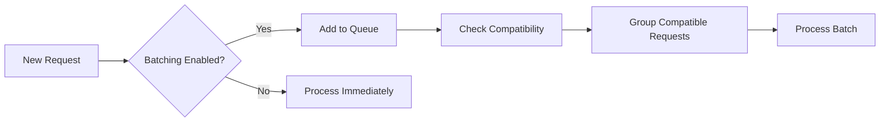

# Intelligent Audio Batching System

## Overview

The audio generation system now supports intelligent batching to improve performance and resource utilization. Batching groups multiple compatible audio generation requests and processes them together, reducing overhead and improving GPU/MPS efficiency.

## Key Features

### 🛡️ **Safety First**
- **Automatic fallback**: If batch processing fails, individual processing is used
- **Compatibility checking**: Only compatible requests are batched together
- **Memory constraints**: Prevents memory overflow with text length limits
- **Error isolation**: Failed requests don't affect the entire batch

### 📦 **Smart Grouping**
- **Voice compatibility**: Groups requests with same voice, checkpoint, speed, pitch
- **Text length limits**: Prevents memory issues with long texts
- **Timeout-based processing**: Ensures responsive processing even with small batches
- **Dynamic batch sizing**: Adapts to available requests and worker capacity

### ⚡ **Performance Benefits**
- **Reduced model loading overhead**: Reuses voice setup across batch items
- **Better GPU utilization**: Processes multiple requests in sequence efficiently
- **Improved throughput**: Higher total requests per second
- **Memory optimization**: Shared resources for compatible requests

## Configuration

### Environment Variables

```bash
# Enable/disable batching (default: true)
ENABLE_BATCHING=true

# Maximum requests per batch (default: 4)
MAX_BATCH_SIZE=4

# Timeout before processing incomplete batch (default: 500ms)
BATCH_TIMEOUT_MS=500

# Maximum total text length per batch (default: 2000)
MAX_BATCH_TEXT_LENGTH=2000
```

### Configuration Examples

#### High Throughput Setup
```bash
ENABLE_BATCHING=true
MAX_BATCH_SIZE=6
BATCH_TIMEOUT_MS=1000
MAX_BATCH_TEXT_LENGTH=3000
CONCURRENT_REQUESTS=4
```
- **Best for**: Large podcast generation, batch processing
- **Trade-off**: Slightly higher latency for individual requests
- **Memory**: Requires more RAM/GPU memory

#### Low Latency Setup
```bash
ENABLE_BATCHING=true
MAX_BATCH_SIZE=2
BATCH_TIMEOUT_MS=200
MAX_BATCH_TEXT_LENGTH=1000
CONCURRENT_REQUESTS=2
```
- **Best for**: Real-time applications, interactive use
- **Trade-off**: Lower throughput for better responsiveness
- **Memory**: Lower memory requirements

#### Disable Batching
```bash
ENABLE_BATCHING=false
```
- **Best for**: Debugging, testing, memory-constrained systems
- **Trade-off**: Lower overall performance but simpler behavior

## How It Works

### 1. Request Queueing


### 2. Compatibility Checking
Requests are considered compatible when they have identical:
- Voice name
- Checkpoint path
- Speed, pitch, emotion, style settings
- Combined text length under limit

### 3. Fallback Safety


## Monitoring and Debugging

### Status Information
```typescript
const status = getWorkerStatus();
console.log(status);
// Output:
// {
//   totalWorkers: 2,
//   readyWorkers: 2,
//   busyWorkers: 0,
//   queueSize: 3,
//   batchingEnabled: true
// }
```

### Log Messages
- `📦 Worker X: Processing batch of Y requests` - Batch started
- `✅ Worker X: Batch completed - Y/Z successful` - Batch finished
- `⚠️ Worker X: Batch not compatible, falling back` - Compatibility issue
- `❌ Worker X: Batch processing failed, falling back` - Error recovery

## Performance Optimization

### Memory Management
- Each batch monitors RAM and GPU memory usage
- Automatic memory cleanup after batch completion
- Conservative text length limits prevent OOM

### GPU/MPS Optimization
- Shared voice model setup across batch items
- Efficient PyTorch memory management
- Flash Attention support when available

### Adaptive Batching
- Timeout ensures responsiveness
- Compatible request grouping maximizes efficiency
- Fallback maintains reliability

## Best Practices

### 1. Configuration Tuning
- Start with default settings
- Monitor memory usage under load
- Adjust batch size based on available memory
- Tune timeout for your latency requirements

### 2. Voice Organization
- Group similar voice requests together
- Use consistent voice settings when possible
- Avoid mixing different checkpoints unnecessarily

### 3. Monitoring
- Watch for fallback messages in logs
- Monitor worker utilization
- Check memory usage patterns

### 4. Troubleshooting
- Disable batching if experiencing issues
- Reduce batch size for memory problems
- Lower timeout for latency issues
- Check voice compatibility for failed batches

## Safety Guarantees

✅ **No request loss**: Failed batches fall back to individual processing  
✅ **Error isolation**: One failed request doesn't affect others  
✅ **Memory protection**: Text length limits prevent overflow  
✅ **Graceful degradation**: System works with batching disabled  
✅ **Timeout protection**: Requests don't wait indefinitely  
✅ **Compatibility validation**: Only safe combinations are batched  

## Example Usage

```typescript
// Multiple requests with same voice settings will be automatically batched
const requests = [
  { text: "Hello world", speaker: "default", settings: { speed: 1.0 } },
  { text: "How are you?", speaker: "default", settings: { speed: 1.0 } },
  { text: "Nice to meet you", speaker: "default", settings: { speed: 1.0 } }
];

// These will be grouped into a single batch automatically
const results = await Promise.all(
  requests.map((req, i) => generateAudio(req.text, req.speaker, i, 1, "output"))
);
```

The batching system handles all the complexity automatically while maintaining safety and reliability. 